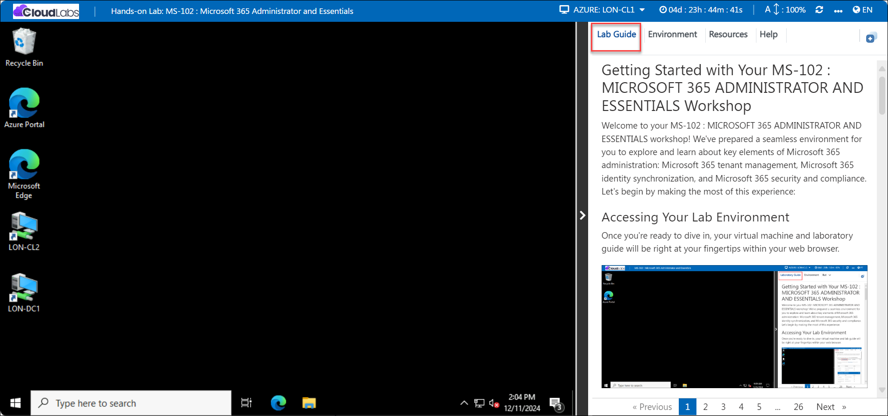
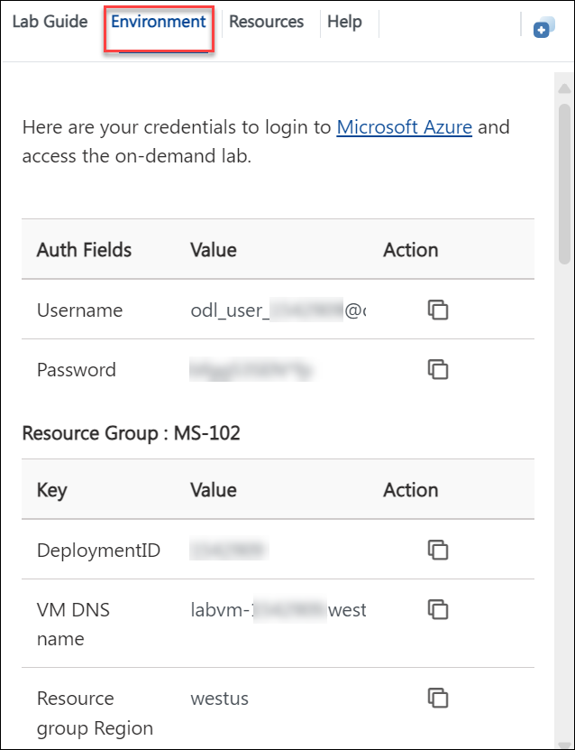
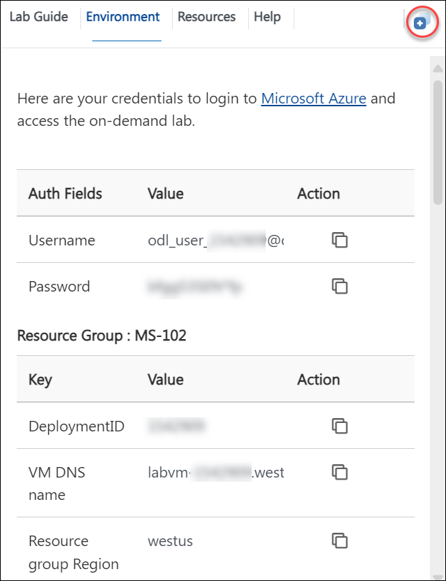
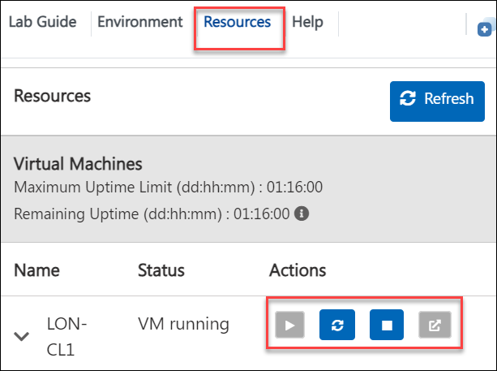

# Getting Started with Your MS-102 : MICROSOFT 365 ADMINISTRATOR AND ESSENTIALS Workshop

### Overall Estimated Duration: 120 hours

## Overview

The **MS-102: MICROSOFT 365 ADMINISTRATOR AND ESSENTIALS Workshop** introduces participants to foundational knowledge and hands-on experience required to administer Microsoft 365 environments effectively. It covers essential skills such as managing identities, access, and compliance, while ensuring users can leverage productivity tools efficiently. Tailored for IT professionals, the course focuses on deploying and managing Microsoft 365 services, troubleshooting issues, and optimizing resources to align with organizational needs. It is perfect for those preparing for certification or looking to enhance their administrative capabilities in Microsoft 365 ecosystems.

## Objective

This lab is designed to equip participants with hands-on experience in exploring Microsoft 365 administration, including managing identities, configuring services, and ensuring compliance within a secure and efficient environment.

-   **Initialize your Microsoft 365 Tenant** : Set up and configure your Microsoft 365 environment for organizational use. 
-   **Manage Users and Groups** : Create, manage, and organize users and groups within Microsoft 365.
-   **Manage Administration Delegation** : Assign and manage administrative roles and permissions in Microsoft 365.
-   **Monitor and Troubleshoot Microsoft 365** : Track performance and resolve issues across Microsoft 365 services.
-   **Manage a Microsoft 365 Apps for enterprise installation** : Deploy and manage Office apps across your organization.
-   **Prepare for Identity Synchronization** : Set up your environment to synchronize identities between on-premises and cloud.
-   **Implement Identity Synchronization** : Configure and enable identity synchronization using tools like Azure AD Connect.
- **Manage secure user access** : Enhance security with multi-factor authentication and conditional access policies.
- **PIM Administrator approval** : Configure Privileged Identity Management for administrator approval workflows.
- **PIM Self-Approval** : Enable users to self-approve roles with Privileged Identity Management.
- **PIM Teammate Approval Request** : Facilitate role assignment requests through teammate approval in PIM.
- **Implement a Safe Attachments policy** : Configure policies to protect users from malicious email attachments.
- **Implement a Safe Links Policy** : Set up policies to safeguard users from harmful links in emails or documents.
- **Prepare for Alert Policies** : Ready your environment for creating and managing alert policies.
- **Implement Mailbox Permission Alert** : Configure alerts for unauthorized mailbox access or permission changes.
- **Implement SharePoint Permission Alert** : Set up alerts for sensitive changes in SharePoint permissions.
- **Test the Default eDiscovery Alert** : Verify the effectiveness of default eDiscovery alerts for compliance monitoring.
- **Conduct a Spear Phishing attack using Attack Simulation training** : Simulate spear phishing attacks to train and assess user awareness.
- **Conduct a Drive-by URL attack using Attack Simulation training** : Simulate drive-by attacks to evaluate security awareness.
- **Initialize Compliance** : Configure compliance settings to meet regulatory and organizational standards.
- **Configure In-place Archiving and Retention Policies** : Enable and manage data retention and archiving solutions.
- **Create message encryption rules** : et up encryption rules to protect email communication.
- **Manage and Test the DLP Policies** : Configure and validate data loss prevention policies.
- **Implement Sensitivity labels with Azure Information Protection Unified Labels client** : Apply sensitivity labels to secure organizational data.
  
## Prerequisites

Participants should have the following prerequisites:

-   **Basic familiarity with Microsoft 365 :** Understanding of Microsoft 365 tools and navigation in the Microsoft environment.
-   **Fundamental understanding of business processes :** Awareness of common workflows and data management concepts.
-   **No prior coding experience required :**  This lab is beginner-friendly and focuses on low-code solutions.

## Architechture

The PL-900 workshop architecture integrates key Microsoft Power Platform components to create comprehensive business solutions. **Microsoft Dataverse** and other data sources like SharePoint and Excel store the data. **Power Apps** enables the creation of canvas and model-driven apps, while **Power Automate** automates workflows. **Power BI** visualizes data through dashboards, and **Power Virtual Agents** builds chatbots. The platform integrates with **Microsoft 365**, **Azure**, and third-party services to streamline processes, analyze data, and enhance workflows.

## Architechture Diagram

## Explanation of Components

The architecture for this lab involves several key components:

-   **Microsoft Dataverse** : A unified data platform that allows you to securely store and manage data used by business applications. It simplifies data integration and ensures seamless data connectivity across apps.
-   **Power Apps** : A suite of tools for building custom low-code apps. With Canvas Apps, you can design personalized, flexible user interfaces, while Model-Driven Apps are data-driven, offering a structured approach to app development.
-   **Power Automate** : A tool that automates repetitive tasks and workflows between applications and services, reducing manual effort. It can trigger actions based on specific events, such as sending emails, approving requests, or updating data.
-   **Power BI** : A data visualization tool that helps you transform raw data into interactive reports and dashboards. It connects to various data sources to analyze and present insights, enabling informed decision-making.
  
## Getting Started with Lab

Welcome to the PL-900 Microsoft Power Platform Fundamentals Lab! We've prepared an interactive environment for you to explore Power Apps, Power Automate, and Power BI. 

## Accessing Your Lab Environment
 
Once you're ready to dive in, your virtual machine and **Lab Guide** will be right at your fingertips within your web browser.

    

## Virtual Machine & Lab Guide

In the integrated environment, the lab VM serves as the designated workspace, while the lab guide is accessible on the right side of the screen.

**Note**: Kindly ensure that you are following the instructions carefully to ensure the lab runs smoothly and provides an optimal user experience.
 
## Exploring Your Lab Resources
 
To get a better understanding of your lab resources and credentials, navigate to the **Environment** tab.

    
 
## Utilizing the Split Window Feature
 
For convenience, you can open the lab guide in a separate window by selecting the **Split Window** button from the Top right corner.
 
    
 
## Managing Your Virtual Machine
 
Feel free to start, stop, or restart your virtual machine as needed from the **Resources** tab. Your experience is in your hands!
 
   

## Support Contact
 
The CloudLabs support team is available 24/7, 365 days a year, via email and live chat to ensure seamless assistance at any time. We offer dedicated support channels tailored specifically for both learners and instructors, ensuring that all your needs are promptly and efficiently addressed.

Learner Support Contacts:
- Email Support: labs-support@spektrasystems.com
- Live Chat Support: https://cloudlabs.ai/labs-support

Now, click on **Next** from the lower right corner to move on to the next page.

### Happy Learning!!