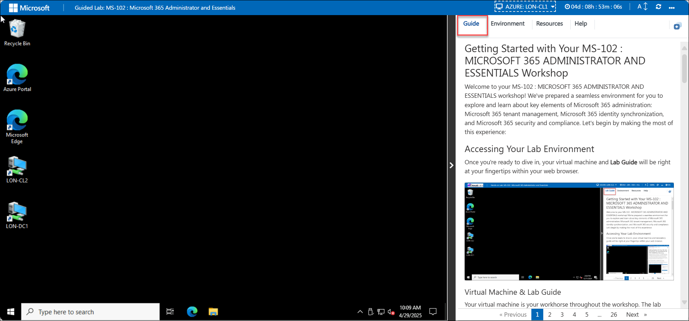
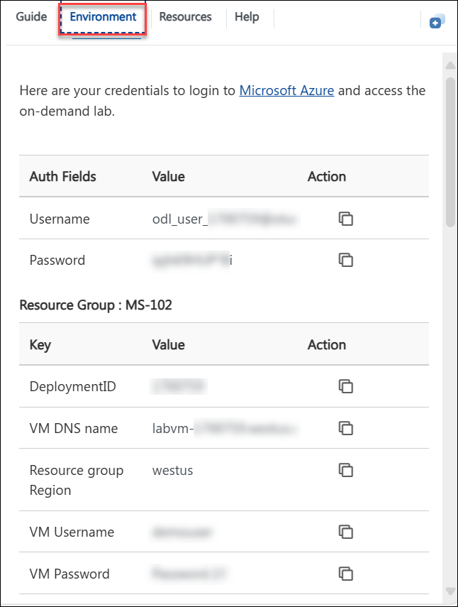
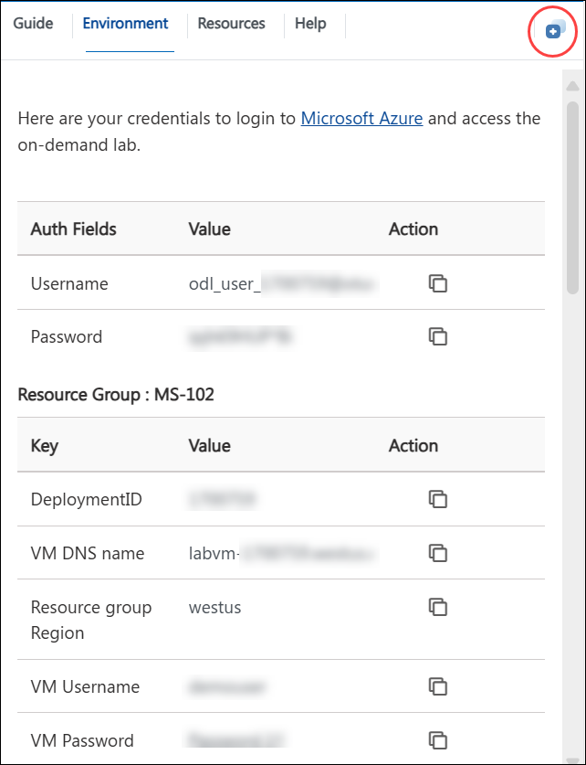
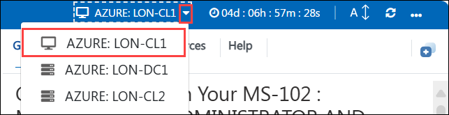
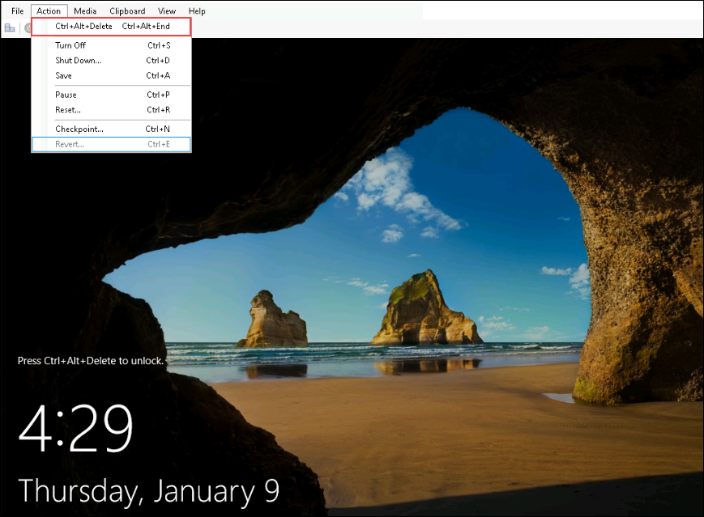
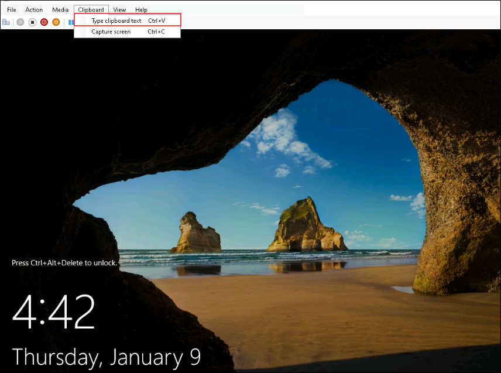
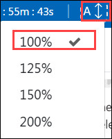
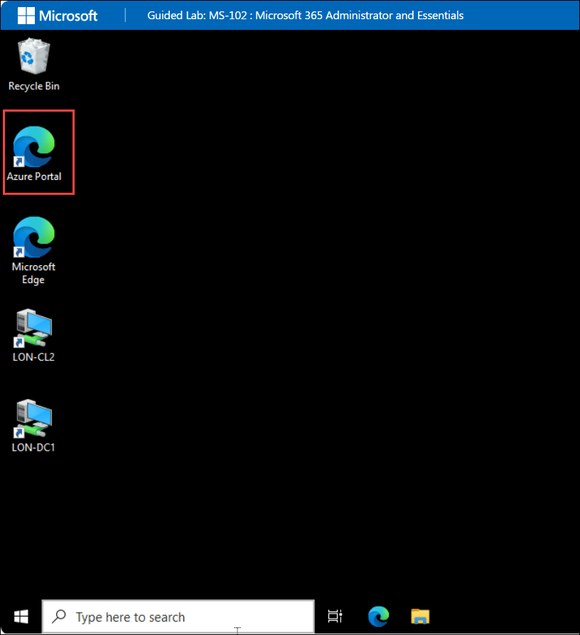

# Getting Started with Your MS-102 : MICROSOFT 365 ADMINISTRATOR AND ESSENTIALS Workshop
 
Welcome to your MS-102 : MICROSOFT 365 ADMINISTRATOR AND ESSENTIALS workshop! We've prepared a seamless environment for you to explore and learn about key elements of Microsoft 365 administration: Microsoft 365 tenant management, Microsoft 365 identity synchronization, and Microsoft 365 security and compliance. Let's begin by making the most of this experience:
 
## Accessing Your Lab Environment
 
Once you're ready to dive in, your virtual machine and **Lab Guide** will be right at your fingertips within your web browser.
 
 

### Virtual Machine & Lab Guide
 
Your virtual machine is your workhorse throughout the workshop. The lab guide is your roadmap to success.
 
## Exploring Your Lab Resources
 
To get a better understanding of your lab resources and credentials, navigate to the **Environment** tab.
 

## Utilizing the Split Window Feature
 
For convenience, you can open the lab guide in a separate window by selecting the **Split Window** button from the Top right corner.
 

 
## Managing Your Virtual Machine
 
1. Feel free to start, stop, or restart your virtual machine as needed from the **Resources** tab. Your experience is in your hands!
 
    

2. To initiate the required VMs, use the dropdown menu located at the top of the lab environment

    
 
3. When logging into the Hyper-V virtual machines, if a message appears stating **"Press Ctrl+Alt+Delete to unlock"**, navigate to the **Actions** menu in the Virtual Machine Connection window and select the **Ctrl+Alt+Delete** option, as shown in the image below.

    

4. If you face an issue while copying the content from the lab guide and pasting it into the Hyper-V virtual machines, navigate to the **Clipboard** option in the Virtual Machine Connection window and select **Type Clipboard Text**.

      

## Lab Guide Zoom In/Zoom Out
 
1. To adjust the zoom level for the environment page, click the **A↕ : 100%** icon located next to the timer in the lab environment.

   

## Pasting Commands in the PowerShell/CloudShell Environment

Please make sure to use the **CTRL+SHIFT+V** or **CTRL+V** keys when pasting commands inside the PowerShell/CloudShell environment instead of right-clicking

## Let's Get Started with Azure Portal
 
1. On your virtual machine, click on the Azure Portal icon as shown below:
 
    

2. You'll see the **Sign into Microsoft Azure** tab. Here, enter your credentials:
 
   - **Email/Username:** <inject key="AzureAdUserEmail"></inject>
 
        
 
3. Next, provide your password:
 
   - **Password:** <inject key="AzureAdUserPassword"></inject>
 
        

4. If prompted to stay signed in, you can click "No."
 
5. If a **Welcome to Microsoft Azure** pop-up window appears, simply click "Maybe Later" to skip the tour.

6. If you want a list of users and their email IDs, you can select the **Environment** page and scroll down to view the users list. 

    >**Note:** You can also check the users on the **Microsoft Entra ID** portal. Follow the below steps:

    - In the **Search resources, services and docs** search and select **Microsoft Entra ID**.

    - From the left-hand navigation pane select **Users**, it will display all the users list.

    - Keep this tab open for your entire lab.

## Steps to Proceed with MFA Setup if "Ask Later" Option is Not Visible

1. At the **"More information required"** prompt, select **Next**.

1. On the **"Keep your account secure"** page, select **Next** twice.

1. **Note:** If you don’t have the Microsoft Authenticator app installed on your mobile device:

   - Open **Google Play Store** (Android) or **App Store** (iOS).
   - Search for **Microsoft Authenticator** and tap **Install**.
   - Open the **Microsoft Authenticator** app, select **Add account**, then choose **Work or school account**.

1. A **QR code** will be displayed on your computer screen.

1. In the Authenticator app, select **Scan a QR code** and scan the code displayed on your screen.

1. After scanning, click **Next** to proceed.

1. On your phone, enter the number shown on your computer screen in the Authenticator app and select **Next**.
       
1. If prompted to stay signed in, you can click "No."
 
1. If a **Welcome to Microsoft Azure** pop-up window appears, simply click "Maybe Later" to skip the tour.

## Support Contact
 
The CloudLabs support team is available 24/7, 365 days a year, via email and live chat to ensure seamless assistance at any time. We offer dedicated support channels tailored specifically for both learners and instructors, ensuring that all your needs are promptly and efficiently addressed.

Learner Support Contacts:
- Email Support: labs-support@spektrasystems.com
- Live Chat Support: https://cloudlabs.ai/labs-support

- Now, click on **Next** from the lower right corner to move on to the next page.

    
 
Now you're all set to explore the powerful world of technology. Feel free to reach out if you have any questions along the way. Enjoy your workshop!
