# Learning Path 4 - Lab 4 - Exercise 2 - PIM Administrator approval

## Lab scenario

As part of her Microsoft 365 pilot project, Holly Dickson, Adatum's new Microsoft 365 Administrator, wants to implement Privileged Identity Management (PIM) within Microsoft Entra ID (formerly Azure AD). PIM is an Microsoft Entra service that enables you to manage, control, and monitor access to important resources in your organization. These resources include not only Azure, but other Microsoft Online Services, such as Microsoft 365 and Microsoft Intune.

One of Adatum's pain points in its existing system is that it has far too many users who have been assigned administrator roles. This has caused concern among management, who recognize this situation as an existential threat to Adatum's data security. They feel that too many people were originally assigned admin roles that shouldn't have been, and as such, these users have access to secure information and resources that could potentially compromise the organization. 

Because there's a need to reduce the number of users with permanent administrator roles and yet still provide admin privileges to selected users when business justification warrants it, Holly has been tasked with implementing Microsoft Entra Privileged Identity Management service. By implementing PIM, Adatum can reduce the number of users with admin roles and yet still be able to assign users with admin rights on an as-needed basis whenever necessary.

In this lab, you will perform the basic steps involved in implementing PIM for a given admin role:

- Configure the role to require approval and assign an approver
- Assign an eligible user to the role
- Submit a request from the eligible user to be assigned the role
- Approve the request for the role

In this exercise, you will perform these tasks for the Global administrator role. Holly will take on the role of the approver, and Patti Fernandez will be the user requesting access to the role.

>**IMPORTANT:** In Task 3, Patti Fernandez will submit a request to be assigned the Global administrator role. The activation request process is set up to require Multi-Factor Authentication (MFA). If you do not have a phone to complete this process, notify your instructor. You can still complete Tasks 1 and 2, and you may be able to partner up with another student to watch them complete the remaining tasks.

>**BEST PRACTICE REMINDER:** As a best practice in your real-world deployment, you should always write down the first Global admin account’s credentials (in this lab, it's the ODL user account). You should store away this account for security reasons. This first Global admin account should be a non-personalized identity that owns the highest privileges possible in a tenant. It should **NOT** be MFA activated because it is not personalized. 

> Because the username and password for this first Global admin account are typically shared among several users, this account is a perfect target for attacks; therefore, it's always recommended that organizations create personalized service admin accounts (for example, an Exchange admin, SharePoint admin, and so on) and keep as few non-personalized Global admins as possible. For those personal Global administrators that you do create in your real-world deployment, they should each be mapped to a single identity (such as Holly Dickson, Patti Fernandez, etc.), and they should each have Microsoft Entra ID Multi-Factor Authentication (MFA) enforced. That being said, you will not turn on MFA for Holly's account because time is limited in this training course, and we don't want to take up lab time by forcing you to log in using a second authentication method every time Holly logs in.

### Task 1 - Configure the Global Administrator role to require approval

1. The prior lab exercise used Adatum's domain controller (LON-DC1). This lab will use LON-CL1. Switch back to **LON-CL1**. 

1. On **LON-CL1**, you should still be logged into the machine and in your Edge browser, you should still be logged into Microsoft 365 as Holly Dickson.

1. In your browser, select the **Microsoft 365 admin center** tab. In the left-hand navigation pane, select **show all**, scroll down and select **All Admin centers** from the Admin centers section, and select **Microsoft Entra**.

    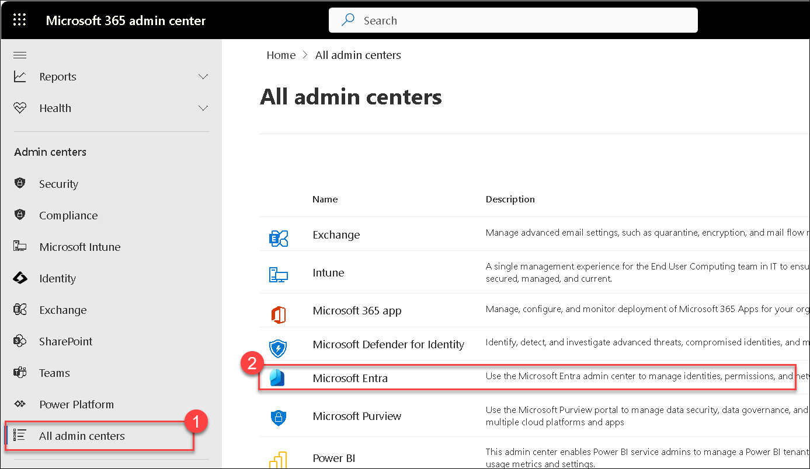

1. In the **Microsoft Entra admin center**, the **Home** page is displayed by default. From the left-hand navigation pane, select **Privileged Identity Management (2)** under **Identity Governance (1)**.

    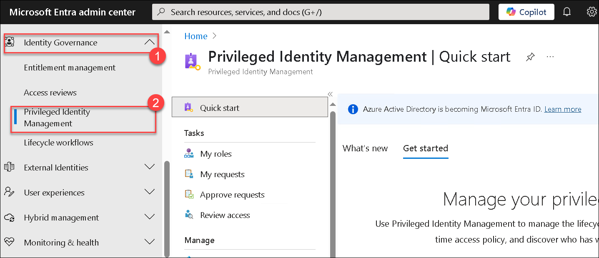

1. In the **Privileged Identity Management | Quick start** window, in the middle pane under the **Manage** section, select **Microsoft Entra roles**.

    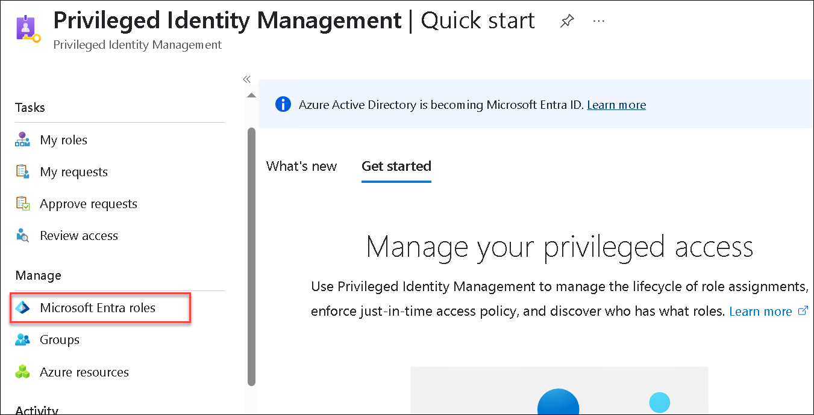

1. In the **Adatum Corporation | Quick start** window, in the middle pane under the **Manage** section, select **Settings (1)**. 

1. In the **Adatum Corporation | Settings** window, select the **Global Administrator (2)** role. 

    >**Tip:** If the roles are not displayed in alphabetical order, select the **Role** heading to sort them in ascending alphabetical order. This will make it easier to locate the Global administrator role.

    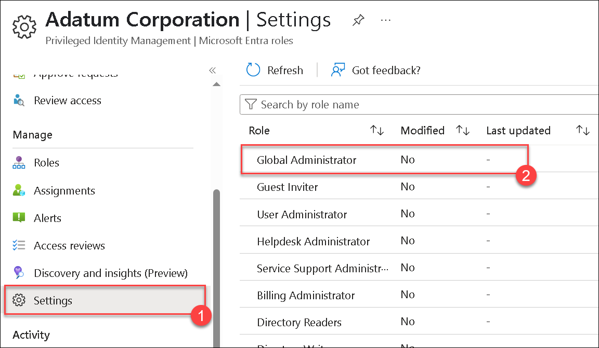

1. In the **Role setting details -  Global Administrator** window, scroll through the page and review the information for role activation, assignment, and notification. Then select **Edit** on the menu bar at the top of the page.

    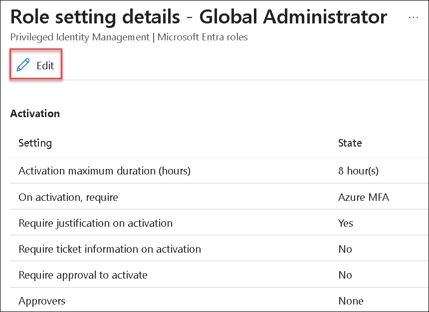

1. In the **Edit role setting - Global Administrator** window, the **Activation** tab is displayed by default. In this tab, below the activation slider, verify the **Azure MFA** option is selected by default for the **On activation, require** setting (if it's not selected, then select it now). This will require that the person requesting activation of the role will have to sign in using multi-factor authentication to provide additional verification that they are who they say they are.

    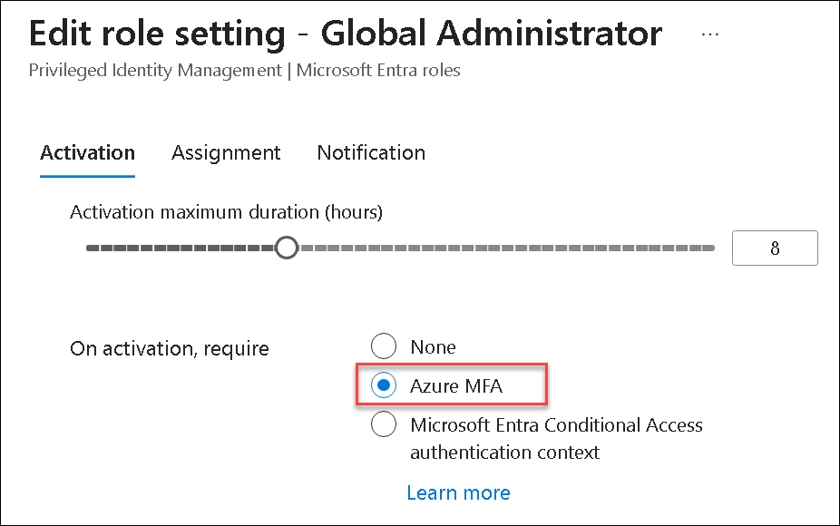

1. The window then displays a group of three settings, each of which has a corresponding check box. Select the **Require Approval to activate** check box. By doing so, the **Select approver(s)** section becomes enabled. Do not change the default settings of the other two check boxes.

1. In the **Select approver(s)** section, no specific approver has been selected. Holly wants to assign herself as the approver for this role, so select **No approver selected (+)** option. In the **Select a member** pane that opens on the right, you would normally scroll through the list of users and select **Holly Dickson**. However, since over 200 users were synchronized from the on-premises Active Directory to Microsoft Entra ID in the prior lab exercise, scrolling through the user list will be too time consuming. 

    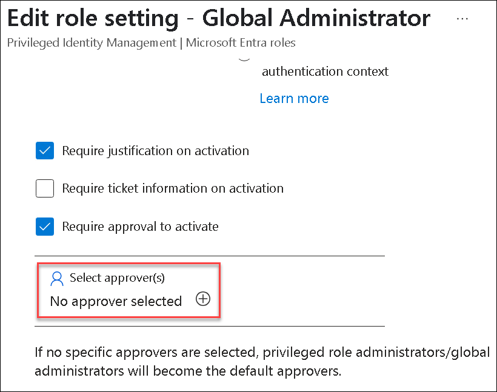

1. Therefore, enter **Holly Dickson (1)** in the **Search** box. In the list of users whose first name starts with Holly, select Holly Dickson's user account that pertains to the onmicrosoft.com domain (**Holly@otuwamocZZZZZZ.onmicrosoft.comm (2)**) (where ZZZZZZ is the tenant prefix provided by your lab hosting provider). Do NOT select Holly's user account that applies to the custom domain. Then select the **Select** button.

    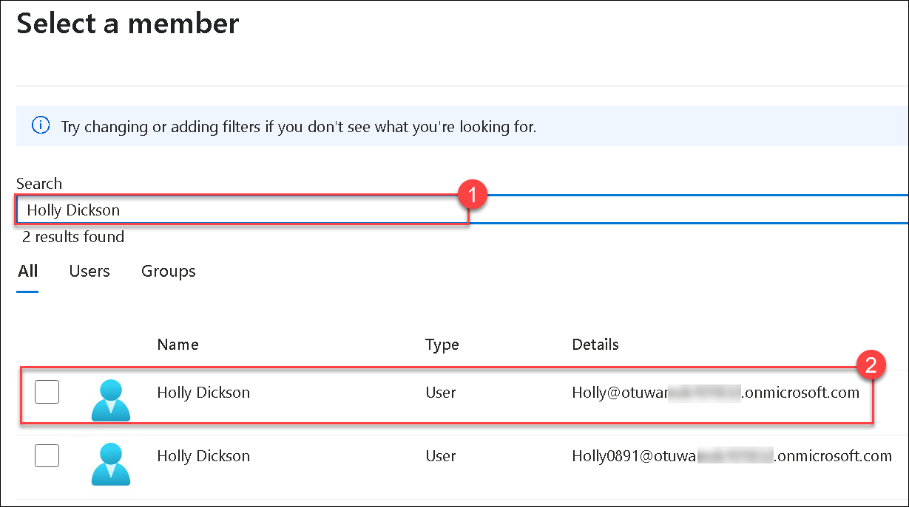

    >**Note:** For example, in **odl_user_@otuwamocZZZZZZ.onmicrosoft.com**, the highlighted portion **(otuwamocZZZZZZ.onmicrosoft.com)** represents the domain name or tenant prefix, which you can replace with your desired tenant prefix.

1. In the **Edit role setting - Global Administrator** window, select the **Notification** tab at the top of the page.

    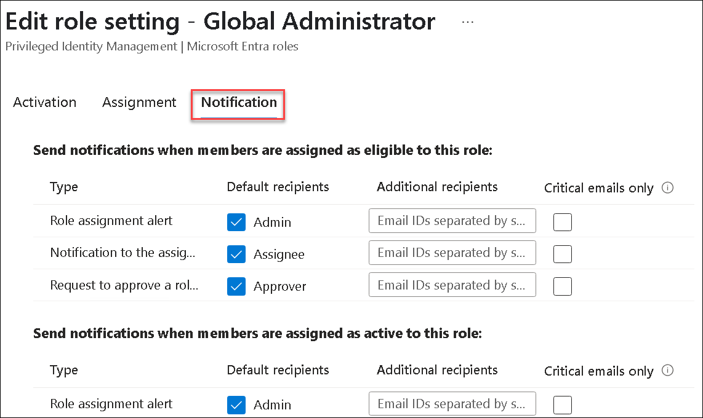

1. On the **Notification** tab, note the three activities that can trigger a notification being sent: **Send notifications when...**    

    - members are assigned as eligible to this role
    - members are assigned as active to this role
    - eligible members activate this role

    - For each of these three activities, an alert can be sent (depending on the activity, it will either be a Role assignment alert or a Role activation alert). The default value for each of these alerts is **Admin**, which refers to the Global Administrators and any Privileged Role Administrators. Besides sending this alert notification email to these admins, Holly wants the alert for each activity sent to the ODL user account. 

    - In the **Additional recipients** field for each of the three alerts (the **Role assignment alert** for the first two activities and the **Role activation alert** for the final activity), enter **<inject key="AzureAdUserEmail"></inject>**.

	    

	    >**Note:** For example, in **odl_user_@otuwamocZZZZZZ.onmicrosoft.com**, the highlighted portion **(otuwamocZZZZZZ.onmicrosoft.com)** represents the domain name or tenant prefix, which you can replace with your desired tenant prefix.

1. At the bottom of the **Edit role setting - Global Administrator** window, select **Update**.

    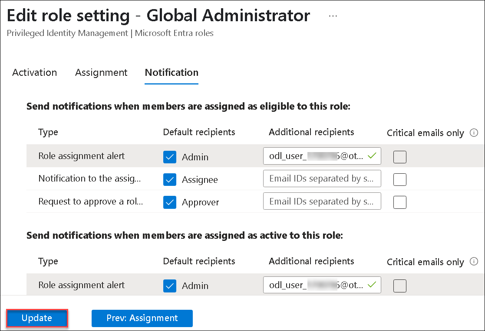

1. Leave all browser tabs open for the next task.

### Task 2 - Assign an eligible group to the Global Admin role

1. On **LON-CL1**, in your Edge browser, you should still be logged into Microsoft 365 as **Holly Dickson**.

1. You will begin by creating a new, role-assignable security group called **PIM-Global-Administrators** in Microsoft Entra ID, and you will assign Patti as a member of the group. 

1. In your **Edge** browser, you should still have the **Microsoft Entra admin center** open in a tab that's displaying the **Adatum Corporation | Settings** window from the prior task. In the left-hand navigation pane, under **Identity (1)** select **Groups (2)**, and then select **All groups (3)**.

    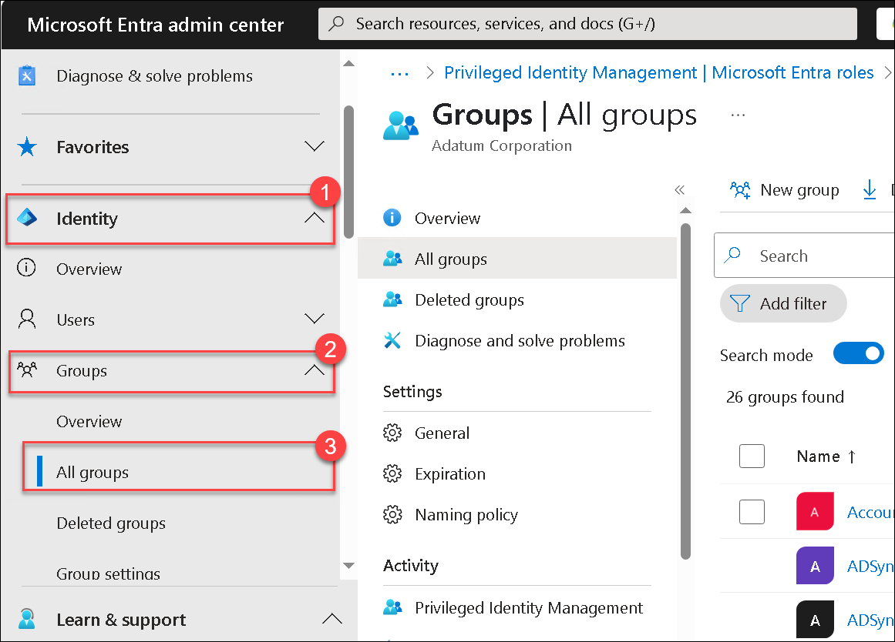

1. In the **Groups | All groups** window, in the detail pane on the right, select **New group** in the menu bar.

    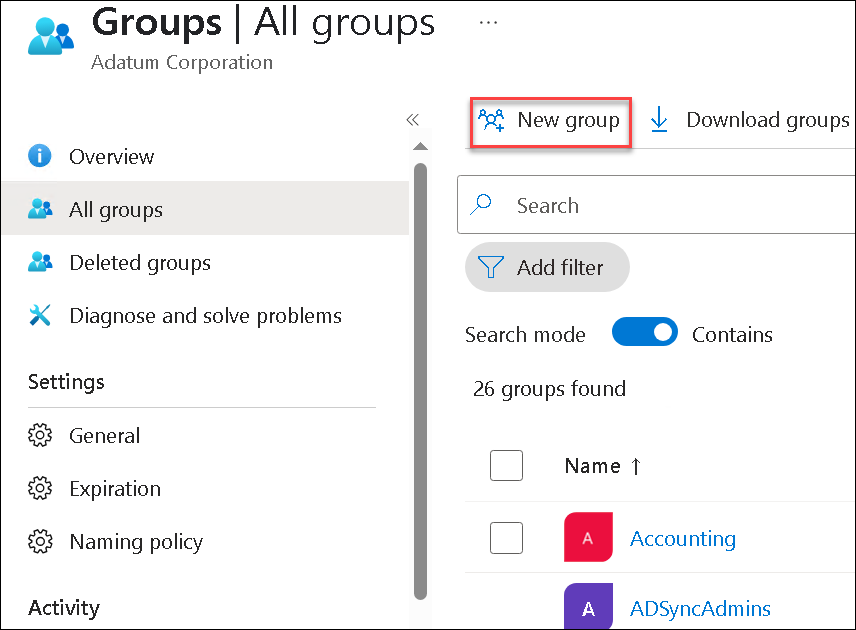

1. In the **New group** window, enter the following information:

    - Group type - **Security (1)**

    - Group name - **PIM-Global-Administrators (2)**

    - Group description - **Group of eligible users that can be assigned to the Global Administrator role in PIM (3)**

    - Microsoft Entra roles can be assigned to the group - **Yes (4)**

    - Membership type - **Assigned (5)**

    - Owners - Select **No owners selected**. In the **Add owners** pane, enter **Holly** in the **Search** field and select the **Holly@otuwamocZZZZZZ.onmicrosoft.com (6)** user account

    - Members - Select **No members selected**. In the **Add members** pane, enter **Patti** in the **Search** field and select **patti.fernandez@otuwamocZZZZZZ.onmicrosoft.com (7)** user account and select **Select** option.

    - Select the **Create (8)** button at the bottom of the page.

	    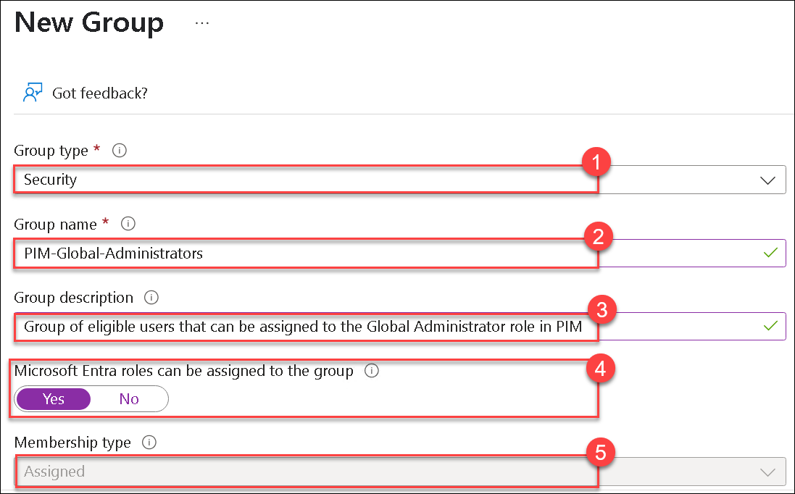

        

	    >**Note:** For example, in **odl_user_@otuwamocZZZZZZ.onmicrosoft.com**, the highlighted portion **(otuwamocZZZZZZ.onmicrosoft.com)** represents the domain name or tenant prefix, which you can replace with your desired tenant prefix.

1. A dialog box appears at the top of the page that says: **Creating a group to which Microsoft Entra roles can be assigned is a setting that cannot be changed later. Are you sure that you want to add this capability?**. Select **Yes**.

    

1. You must now make the **PIM-Global-Administrators** group eligible for role assignment. In the left-hand navigation pane, select **Identity Governance** to expand the section, and then select **Privileged Identity Management**.

1. In the **Privileged Identity Management | Quick start** window, in the middle pane under the **Manage** section, select **Microsoft Entra roles**.

1. In the **Adatum Corporation | Quick start** window, the detail pane on the right displays the **Privileged Identity Management** window. This window displays the following sections - Assign, Activate, Approve, and Audit. Under the **Assign** section, select the **Assign Eligibility** button.

    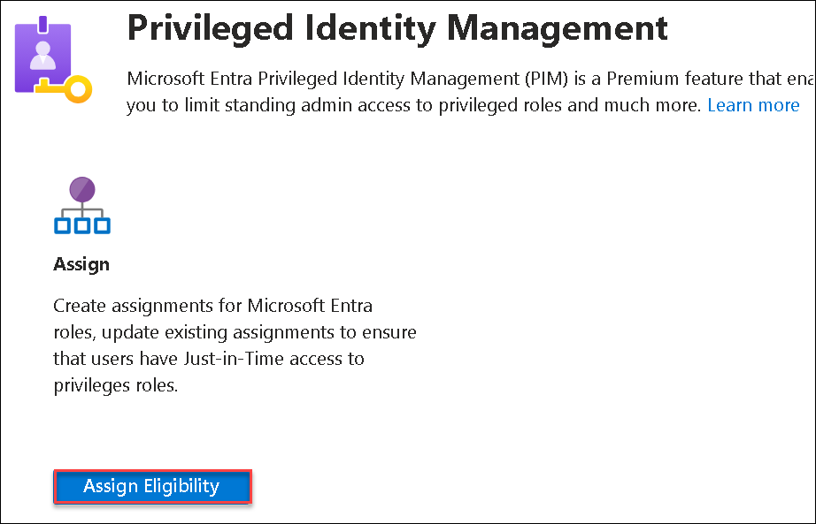

1. In the **Adatum Corporation | Roles** window, search for and select the "**Global Administrator**" role.

    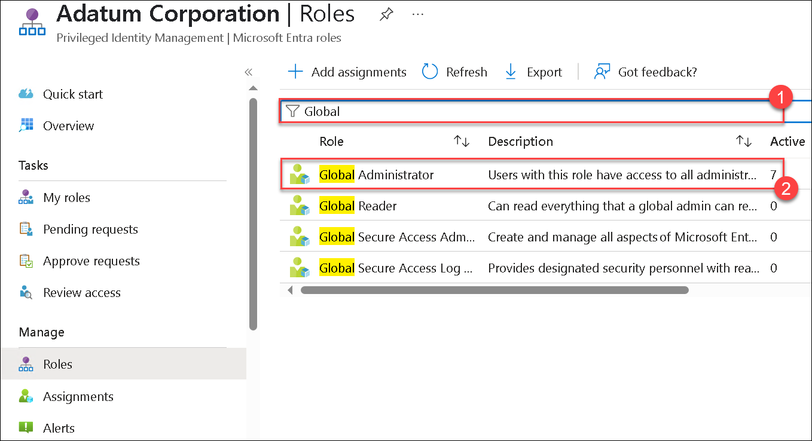

1. In the **Global Administrator | Assignments** window, select **+ Add assignments** on the menu bar. 

1. In the **Add assignments** window, the **Membership** tab is displayed by default. Under **Select member(s)**, select **No member selected**.

1. In the **Select a member** pane that appears on the right, enter **PIM** in the **Search** field. This will display the list of eligible users and groups whose name starts with **PIM (1)**. Select the **PIM-Global-Administrators (2)** group that appears, and then select the **Select (3)** button.

    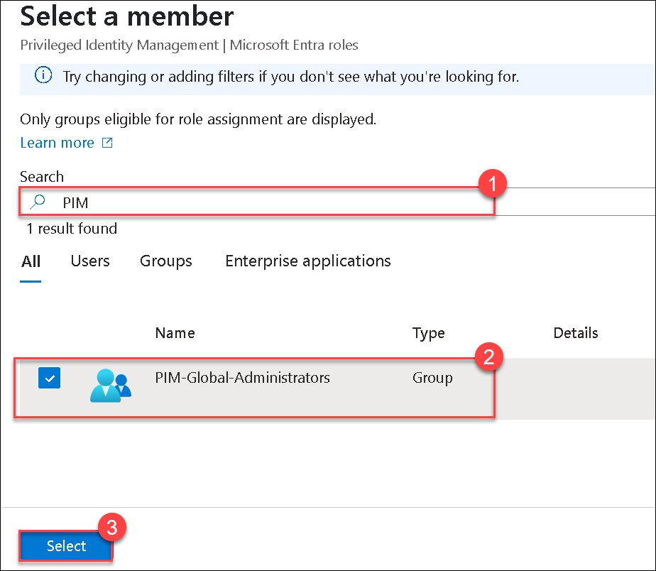

1. In the **Add assignments** window, select **Next >** (this does the same thing as selecting the **Setting** tab). 

1. In the **Add assignments** window, under the **Setting** tab, verify the **Assignment type** option is set to **Eligible**. Also verify the **Permanently eligible** check box is selected (if not, then do so now), and then select **Assign**. 

1. In the **Global Administrator | Assignments** window, note that the **PIM-Global-Administrators** group is an eligible assignment to the Global Administrator role. Because **PIM-Global-Administrators** is a group, it means that all members of this group (which consists of Patti Fernandez) are now eligible to be assigned the Global Administrator role.

    >**Note:** Lab testing has shown that it can sometimes take up to 30 minutes for new assignments to appear under the **Eligible assignments** tab. If **PIM-Global-Administrators** doesn't appear immediately, wait a few minutes and then select the **Refresh** option on the menu bar. Continue to select the **Refresh** option every few minutes until **PIM-Global-Administrators** appears in the list of **Eligible assignments**.

    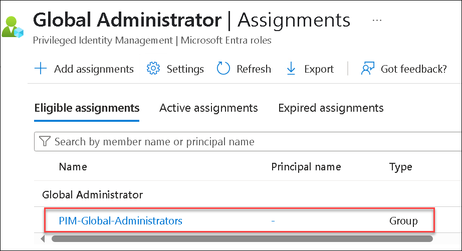

1. Leave all browser tabs open for the next task.

### Task 3 - Submit a request for the Global Admin role

>**NOTE:** The activation request process is set up to require multifactor authentication (MFA). If you do not have a  to complete this process, notify your instructor. You may be able to partner with another student to watch them complete the remaining two tasks.

1.  In LON-CL1, right-click on the **Edge** icon on the taskbar and in the menu that appears, select **New InPrivate window**. 

    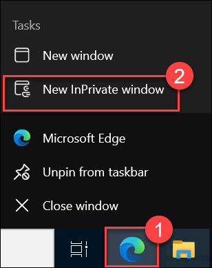

1. In your **InPrivate browsing** session, copy and paste the following URL in the address bar: **[Azure Portal](https://portal.azure.com)**

1. You're now going to log into Azure as Patti Fernandez. In the **Sign in** window, enter **patti.fernandez@otuwamocZZZZZZ.onmicrosoft.com** username and then select **Next**. In the **Enter password** window, enter the **<inject key="AzureAdUserPassword"></inject>** and then select **Sign in**. In the **Stay signed in?** dialog box, select the **Don't show this again** check box and then select **Yes**.

    >**Note:** For example, in **odl_user_@otuwamocZZZZZZ.onmicrosoft.com**, the highlighted portion **(otuwamocZZZZZZ.onmicrosoft.com)** represents the domain name or tenant prefix, which you can replace with your desired tenant prefix.

1. In the **Welcome to Microsoft Azure** dialog box that appears, select **Cancel** to skip the tour.

1. In the **Microsoft Azure** portal, in the middle of the screen is the section of **Azure services**. This section displays a row of Azure services and their associated icons. At the end of the row, select **More services** (with the forward arrow icon). This opens the **All services** window.

    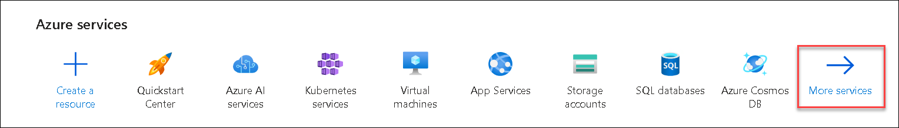

1. In the **All services** window, enter **Microsoft Entra Privileged Identity Management** in the **Search** box at the top of the page. In the list of search results, select **Microsoft Entra Privileged Identity Management**.

1. In the **Privileged Identity Management | Quick start** window, in the **Tasks** section in the left-hand navigation pane, select **My Roles** under the **Tasks** section.

1. In the **My roles | Microsoft Entra roles** window, the **Eligible assignments** tab is displayed by default. Remember, in the prior task Holly assigned Patti as a member of the **PIM-Global-Administrators** group, which Holly later assigned as an eligible group for the Global Administrator role. As such, this role appears in the list of **Eligible assignments (1)**. Under the **Action** column for the Global Administrator role, select **Activate (2)**.

    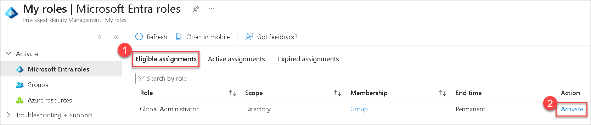

1. In the **Activate - Global Administrator** pane, a warning message is displayed at the top of the pane indicating additional verification is required. Select this message to continue.

1. In the **Activate - Global Administrator** pane that appears on the right-side of the screen, in **Duration (Hours)** field reduced the time to **0.5 (1)**, and enter **Testing PIM (2)** in the **Reason** field. Select the **Activate (3)** button at the bottom of the pane, and wait for the Status to get succeeded for all the steps, it will automatically refresh the browser.

    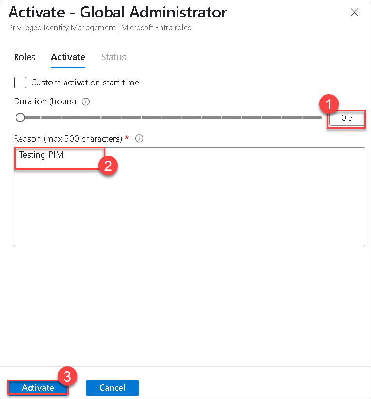

1. On the **My roles | Microsoft Entra roles** window, the **Eligible assignments** tab is displayed on the menu bar. Select the **Active assignments** tab that appears next to it. Note the Global Administrator role does not yet appear. While the role has been activated, it has not been assigned to Patti's account since Holly has not yet approved Patti's request.  

    >**Note:** If you recall, back in Task 1 Holly set up the Global Administrator role so that activation to a user account will require approval. What Patti just did was request that the Global Admin role be activated for her user account. This will send a request to Holly, who can then either approve or deny Patti's request for role activation. Holly will review and then approve this request in the next task.

1. Leave the InPrivate browsing session open. You will return to it in the next task once Holly approves Patti's request.

### Task 4 -  Approve the request for the Global Admin role

1.  In LON-CL1, hover your mouse over the Edge icon on your taskbar to see the two Edge sessions that you have open - the window on the left is the original Edge browser session in which you are signed into **Microsoft 365** as **Holly Dickson**, and the window on the right is the InPrivate Browser session in which you are signed into **Microsoft Entra ID** as **Patti Fernandez**. Select the window on the left to go back to the original Edge browser session in which you are signed in as **Holly Dickson**. 

2.  In your browser, the **Global Administrator | Assignments** window should be displayed in the **Microsoft Entra admin center**. In the navigation thread at the top of the page (**Home > Privileged Identity Management | Microsoft Entra roles > Adatum Corporation | Roles**), select **Privileged Identity Management | Microsoft Entra roles**.

3. In the **Privileged Identity Management | Quick start** window, in the middle pane under **Tasks**, select **Approve requests**.

4. In the **Adatum Corporation | Approve requests** window, in the **Requests for role activations** section, select the check box to the left of the **Global Administrator (1)** request from Patti Fernandez, and then select the **Approve (2)** button.

	>**Note:** Wait for a while if the requests haven’t appeared yet. Since it may take some time, you can proceed with the next exercise and come back later to check here.

    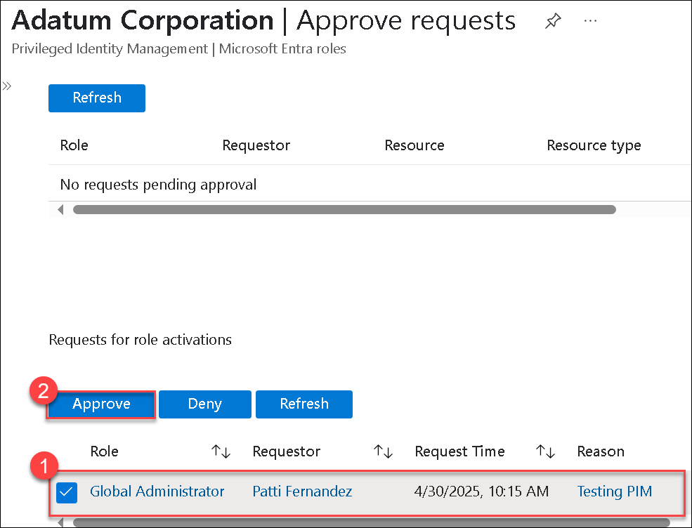

5. In the **Approve Request** pane that appears on the right-side of the screen, enter **PIM testing** in the **Justification** field and then select **Confirm**.

6.  Hover your mouse over the **Edge** icon on the taskbar and select the window on the right to go back to the InPrivate Browser session where Patti is signed in. 

7. In the **My roles | Microsoft Entra roles** window, the **Active assignments (1)** tab is currently selected from the prior task, prior to approving Patti's request. Select **Refresh** on the menu bar.

    >**Note:** How the Global Administrator role is now activated for Patti. You have just verified that Patti has been assigned the Global Administrator role using Microsoft Entra Privileged Identity Management.

    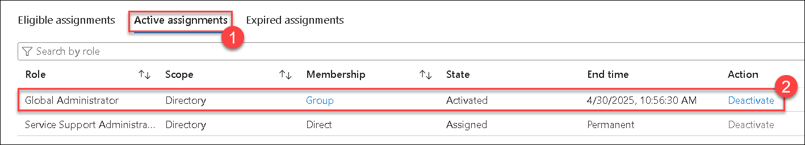

8. Close the InPrivate browser session.

9. In your Edge browser, leave all the tabs open for the next lab.

## Review

In this lab, you have:

- Configured the Global Administrator role to require approval.
- Assigned an eligible group to the Global Admin role.
- Submitted a request for the Global Admin role.
- Approved the request for the Global Admin role.

## The lab has been completed successfully. Click **Next >>** to proceed to the next exercise.
