# Learning Path 6 - Lab 6 - Exercise 6 - Conduct a Drive-by URL attack using Attack Simulation training

## Lab scenario

Holly Dickson is concerned that some of the users at Adatum may require training about avoiding URL links to familiar websites that are either fake or have been hacked. This type of attack is known as a Drive-by URL attack. With this type of attack, a target receives an email containing a URL link, and when the target selects the link, they are taken to a website that runs background code whose sole purpose is to gather information about the target or deploy arbitrary code to their device. As part of her pilot project, Holly has decided to use the Microsoft 365 Attack simulation training feature to determine her users' susceptibility to Drive-by URL attacks.

>**Note:** At the end of this exercise, you will disable MFA for Holly's account. This will save you from having to enter the second form of authentication when signing in as Holly in any of the remaining labs in this course.

### Task 1: Configure and launch a Drive-by URL attack 

1. On LON-CL1, in your Edge browser, you should still be logged into Microsoft 365 as **Holly Dickson**. 

2. After the previous lab exercise, you should still be in the **Microsoft 365 Defender** portal. If not, then in the **Microsoft 365 admin center**, under the **Admin centers** group in the left-hand navigation pane, select **Security**.

3. In the **Microsoft 365 Defender** portal, you should still be on the **Attack simulation training** page; if not, then in the left-hand navigation pane, under **Email & collaboration**, select **Attack simulation training**.

4. On the **Attack Simulation training** page, the **Overview** tab is displayed by default. Select the **Simulations (1)** tab, and then select **+ Launch a simulation (2)** that appears on the menu bar.

	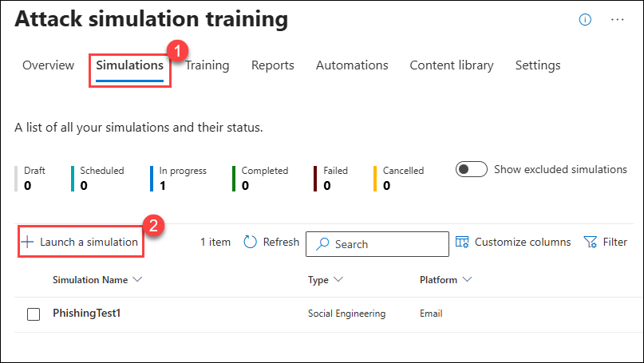

5. On the **Select Technique** page, select the **Drive-by URL (1)** option. Under this option, select the **View details of Drive-by URL (2)** link. This opens a **Drive-by URL** pane on the right. Review the **Description** and the **Simulation steps** for this type of attack. When you're done, close (3) the **Drive-by URL** pane and select **Next (4)**.

	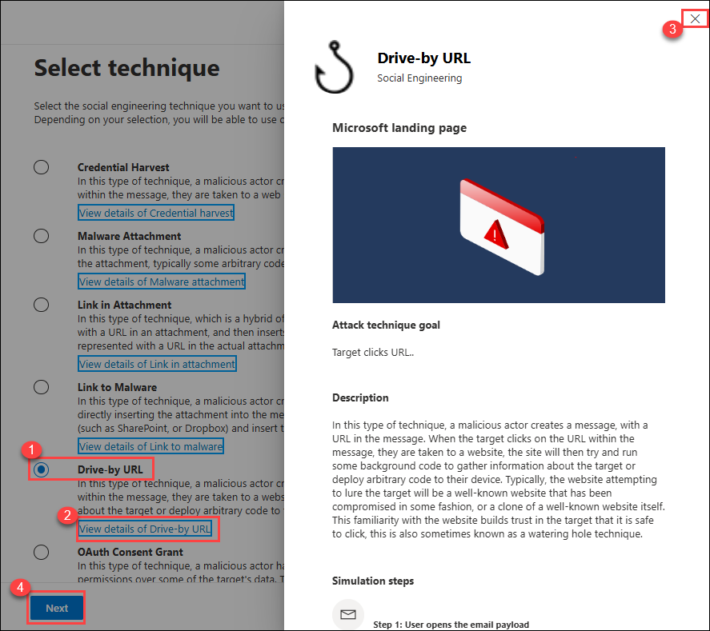

6. On the **Name Simulation** page, enter **Custom payload (1)** in the **Simulation name** field and then select **Next (2)**.

	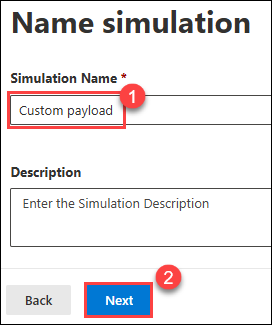

7. On the **Select payload and login page**, the **Global payloads** tab is displayed by default. Select the **Tenant payloads (1)** tab, and then select **+Create a payload (2)** on the menu bar. This initiates the **Payload** wizard.

	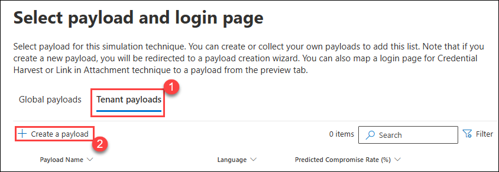

8. On the **Select type** page of the **Payload** wizard, the **Email (1)** option should be selected by default (it may also be grayed out so that you can't change this option).  Select **Next (2)**.  

	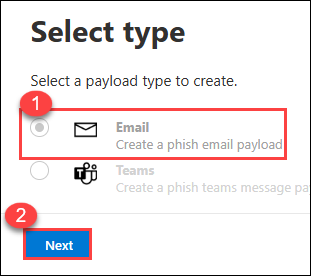

9. On the **Select Technique** page, the **Drive-by URL** attack type should be selected by default (all other options are disabled since you already selected this option back in step 5). Select **Next**.

10. On the **Payload name** page, enter the following information: 

	- Payload name: **Free gift offer**
	- Description: **This payload is for Drive-by URL threats offering free prizes and gifts that are too good to be true**

	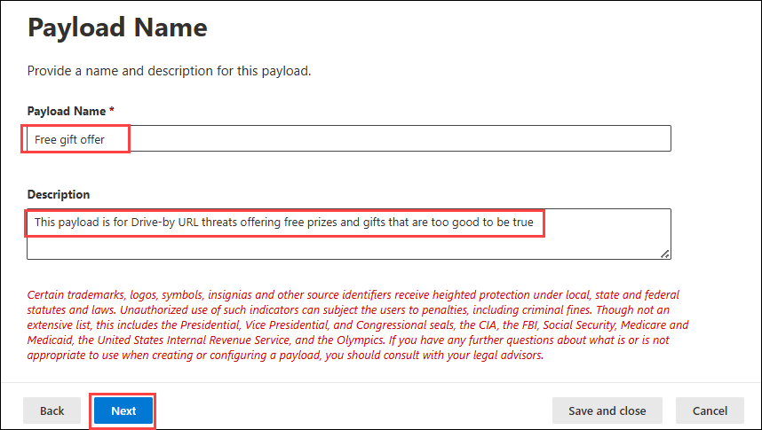

11. Select **Next**.

12. On the **Configure Payload** page, enter the following information: 

	- From name: **Klemen Sic (1)**
	- From email: **klemens@tailspintoys.com (2)**
	- Email subject: **Free toy giveaway promotion from Tailspin Toys (3)**
	- Select a URL you want to be your phishing link: select the **Select URL** button, search and select **https://www.prizegives.com (4)**, from the list of fictitious URLs, and click on **Confirm** button. 
	- Theme: **Personalized Offer (5)**
	- Industry: **Retail (6)**
	- Current Event: **Yes (7)**
	- Select the language for payload : **English (8)** 
	- Email message: Under the Text tab in this **Email message** section, enter the following text in the message box; this message will be displayed in the body of the email message: **Tailspin Toys is offering you a FREE, one-time only giveaway of a toy of your choice as part of our 25th anniversary celebration! Please click on the following link to select the toy of your choice: (9)**
	- After entering the prior message, select the **Phishing link (10)** option at the top of the text form (to the right of **Dynamic tag**). In the **Name Phishing Url** dialog box that appears, enter **Free25thAnniversaryGift@tailspintoys.com** in the **Name** field and then select **Confirm**.

	The message should now appear as: 

	Tailspin Toys is offering you a FREE, one-time only gift of the toy of your choice as part of our 25th anniversary celebration! Please click on the following link to select the toy of your choice: **Free25thAnniversaryGift@tailspintoys.com** 

	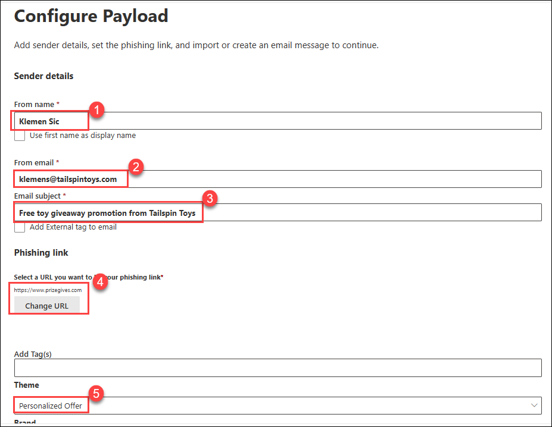

	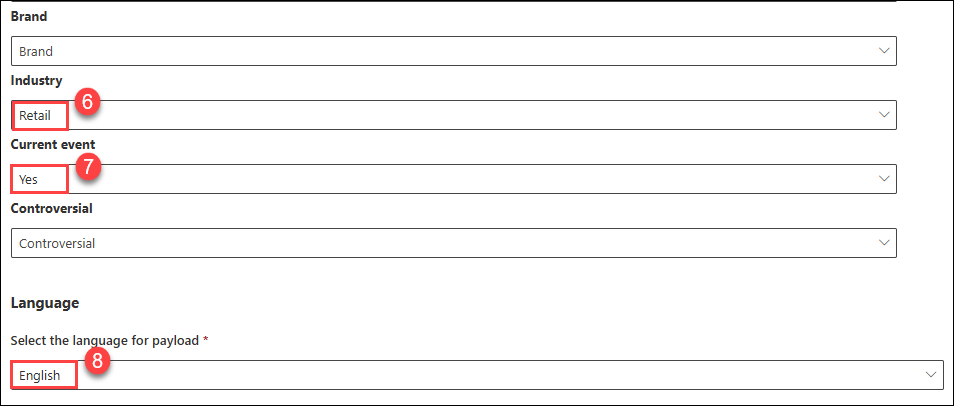

	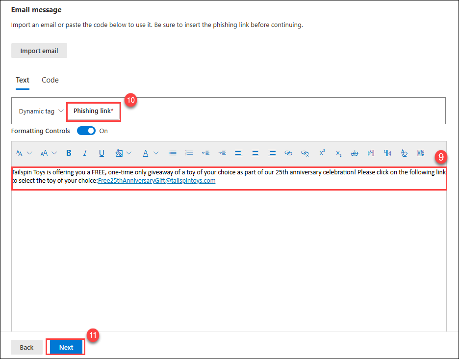

14. Select **Next (11)**.	

15. On the **Add Indicators** page, select **Add Indicator**.

16. On the **Add Indicator** pane that appears on the right, enter the following information: 

	- Select an indicator you would like to use: **Too good to be true offers**
	- Where do you want to place this indicator on payload: **From the Body of the Email**

17. A **Select Text** button will appear. Select this button.

18. In the **Select the required text** pane that appears on the right, drag your cursor from the start of the code block to the end, so that the entire code block is highlighted. This will enable the **Select** button. Select this button. This returns you to the **Add indicator** pane. 

19. In the **Indicator Description** field, replace the default description with the following text: **Free gifts or other one-time only promotional giveaways**.

20. Select inside the **Indicator Preview** to see a preview of the indicator message. Then select outside the **Indicator Preview** field to exit the preview. 

21. Select the **Add** button at the bottom of the **Add Indicator** pane.

22. On the **Add Indicators** page, the indicator that you just created should be displayed. Select **Next**.

23. On the **Review Payload** page, review the entered information. If anything needs to be changed, select the appropriate **Edit** option to make the change, or select **Back** to enter any of the information in the Configure section. Once everything is correct, select **Submit**. After a few moments you will receive a confirmation stating **New payload created**. Select **Done**. 

	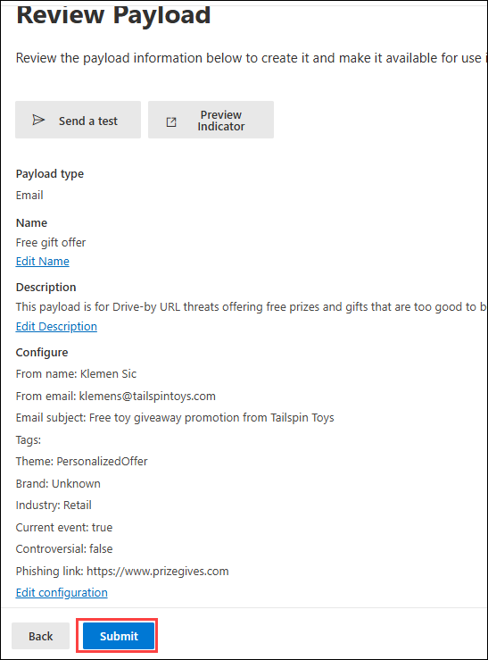

24. On the **Select payload and login page** window, the **Free gift offer** payload that you just created should appear in the list. Review the information for this payload. Note that no **Predicted Compromised rate (%)** has been determined yet, since the payload hasn't been used in a simulation. 

25. On the **Select payload and login page** page, select the check box to the left of the **Free gift offer** payload, and then select **Next**. 

26. On the **Target Users** page, select the **Include only specific users and groups** option, and then select **+Add Users**. 

27. In the **Add Users** pane that appears, in the **Search for Users or Groups** field at the top of the pane, enter **Lynne** and then hit Enter. In the list of users that appears whose name starts with Lynne, select **Lynne Robbins** and then select **Add 1 User(s)**.

28. On the **Target Users** page, Lynne Robbins should be displayed as the targeted user. Select **Next** and then select **Next** again on the **Exclude users** page. 

	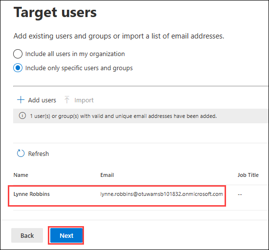

29. On the **Assign Training** page, under the **Preferences** section, the **Assign training for me (Recommended)** option should be selected by default (if not, select it now). Select the **Due Date** field. In the drop-down menu that appears, select **7 days after Simulation ends** and then select **Next**.

30. On the **Select Phish landing page** window, the **Global landing pages** tab should be displayed by default. Select the **Microsoft Landing Page Template 1** name to preview the page. 

31. A preview of the **Microsoft Landing Page Template 1** appears in the pane on the right. This preview panel provides an example of what the landing page will look like when someone experiences a Drive-by URL attack and the simulation uses **Microsoft Landing Page Template 1**. Scroll down through this preview panel and review the features of this template. When you're finished, select the **Close** button at the bottom of the preview panel. 

32. You will now look at some of the other landing page templates until you find one that you want to use for this simulation. On the **Select Phish landing page** window, select one of the other templates (select the name of the template and not its checkbox). Examine the preview panel and note how the landing page for this template is different from **Microsoft Landing Page Template 1**. When you're finished, select the **Close** button at the bottom of the preview panel.

33. Repeat the prior step and select another template. Note how this template is different from the other two you looked at. Repeat this step as many times as you would like until you find a template that you want to use for this simulation. Once you're satisfied with a template, select the checkbox for that template on the **Select Phish landing page** and then select **Next**.

34. On the **Select end user notification** page, choose how you want the end user to be notified. For the purpose of this lab, select **Microsoft default notification (recommended) (1)**. In the list of notifications that appears, configure the following notifications:

	 - Microsoft default positive reinforcement notification - set **Delivery preferences** to **Deliver after simulation ends (2)**
	 - Microsoft default training reminder notification - set **Delivery preferences** to  **Weekly (3)**

	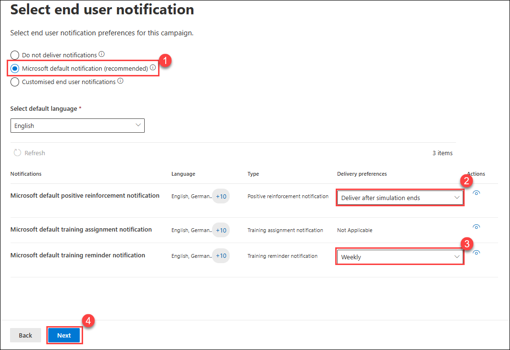

35. Select **Next (4)**.

36. On the **Launch Details** page, select the **Launch this simulation as soon as I'm done** option and then select **Next**.

37. On the **Review Simulation** page, review the entered information. If anything needs to be changed, select the appropriate **Edit** option to make the change. Once everything is correct, select **Submit**. It may take a few minutes before you receive a confirmation stating **Simulation has been scheduled for launch**. Select **Done**.

	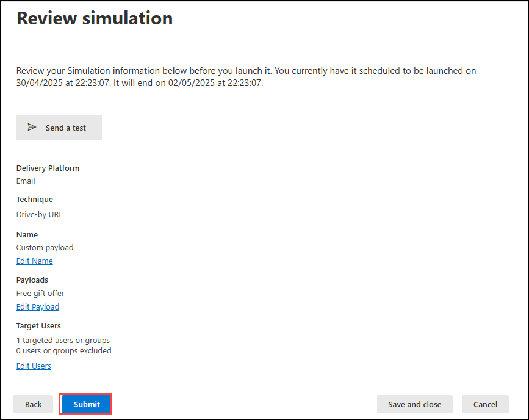

### Task 2: Review the Drive-by URL attack results

1. Switch to **LON-CL2**, by navigating back to the hyper-v manager, and connect to **LON-CL2** VM.

1. On LON-CL2, in the Edge browser, you should have a tab open containing Lynne Robbins' Outlook mailbox from the prior lab exercise. In Lynne's Outlook Inbox, you should see the email that was sent by the Attack Simulator that's from **klemens@tailspintoys.com**. The subject of the email is **Free toy giveaway promotion from Tailspin Toys**. Select the email to open it and review the details in the body of the message. 

	>**NOTE:** It can take up to 15 minutes for the email to arrive.  Wait for the email before proceeding.

1. Select the link that is included in the email. Even though you know this is a Drive-by URL attack, this will enable you to see the effect of doing so in the Attack Simulator report that tracks the results of the spear phishing campaign. Selecting this link displays a web page that explains how you have been redirected to it as part of a Phishing awareness test being run by your organization.  Read through the contents of this site, which uses the landing page template that you selected in the prior task when setting up the attack simulation. 

1. In the **Outlook** tab in your Edge browser, select the picture of Lynne Robbins in the upper-right corner of the window. In Lynne's profile window that appears, select **Sign out**.

1. Once Lynne is signed out, close the Edge browser.

1. Switch back to **LON-CL1**.

1. On LON-CL1, in your browser session where you are logged in as Holly Dickson, you should still be on the **Attack simulation training** page. If the **Custom payload** simulation does not appear in the **Recent Simulations** list, select the **Refresh** icon to the left of the URL on the address bar. The **Custom payload** simulation should now appear. Select the **Custom payload** simulation to view the diagnostic results that were captured for this simulation.

	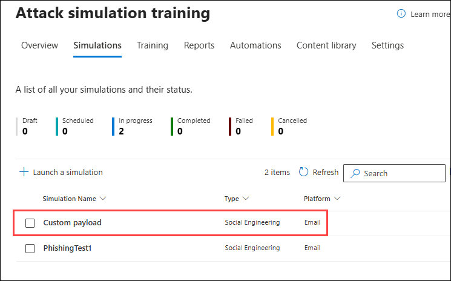

1. A **Custom payload** page should appear. Review all the information collected for this simulated attack. When you're finished, select the **X** in the upper right-hand corner of the window to close it. 

	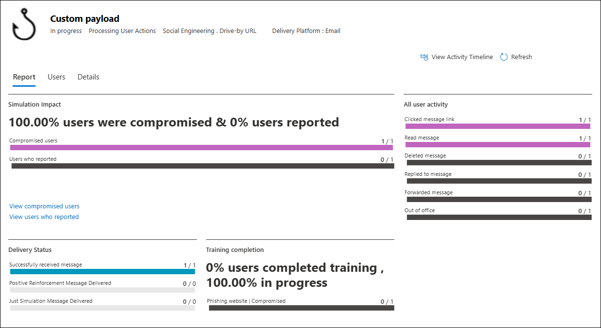

1. Leave your browser open in LON-CL1 and do not close any of the tabs.

### Task 3: Disable Multi-factor Authentication for the Global Admin

1. On LON-CL1, in your Edge browser, you should still be logged into Microsoft 365 as **Holly Dickson**. 

1. To disable MFA for Holly Dickson's user account, you must first access the **Active users** list in the Microsoft 365 admin center. If you have the **Microsoft 365 admin center** open in a browser tab, then select that now; otherwise, open a new browser tab, enter **https://portal.office.com** in the address bar, and then on the **Office 365 home** page, select the **Admin** icon that appears in the column of app icons on the left-side of the screen. This opens the **Microsoft 365 admin center** in a new browser tab. 

1. On the **Microsoft 365 admin center**, in the left-hand navigation pane, select **Users** and then select **Active users**.

1. In the **Active users** window, on the menu bar at the top of the user list, select **Multi-factor authentication**.

1. In the **multi-factor authentication** window (may need to select **Legacy per-user MFA**), the **users** tab is displayed by default. Select the **View (1)** drop-down, select **Global administrators (2)** and then **Apply (3)**. Select the check box for **Holly Dickson**, and in Holly's properties pane on the right, select **Disable MFA**.

	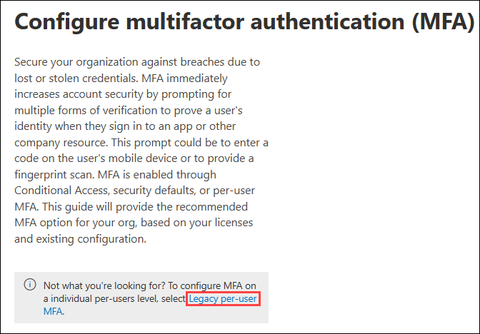

	

1. On the **Disable multifactor authentication** dialog box, select **Disable**. 

1. When the **Updates successful** dialog box appears, select **close**. In the **multi-factor authentication** window, verify Holly's MFA Status has changed to **Disabled**. Close the **Multi-factor authentication** tab in your browser.

1. You must now sign out of Microsoft 365 as Holly and then sign back in as Holly (without MFA). To do so, perform the following steps: 

	- Select Holly's account icon (HD in a circle) at the top-right of the screen and in Holly's profile window, select **Sign out**.
	- Once you're signed out, close your Edge browser. Doing so will clear your cache.
	- Open a new Edge browser session.
	- Enter the **https://portal.office.com** URL.
	- In the **Pick an account** window, select Holly's account and enter the password.
	- From the **Microsoft Office Home** page, select the **Admin** icon to navigate to the **Microsoft 365 admin center**.
	
You are now ready to proceed to the next lab exercise.

## Review

In this lab, you have:

- Configured and launch a Drive-by URL attack .
- Reviewed the Drive-by URL attack results.
- Disabled Multi-factor Authentication for the Global Admin.

## Proceed to the next exercise.
 
